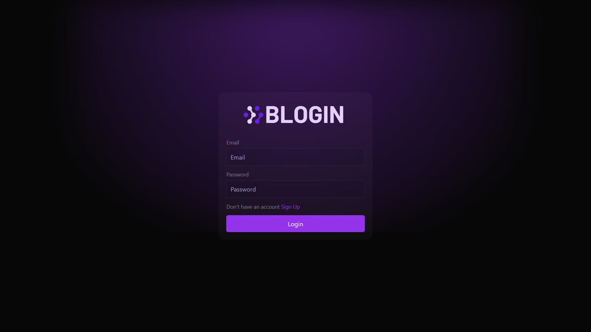
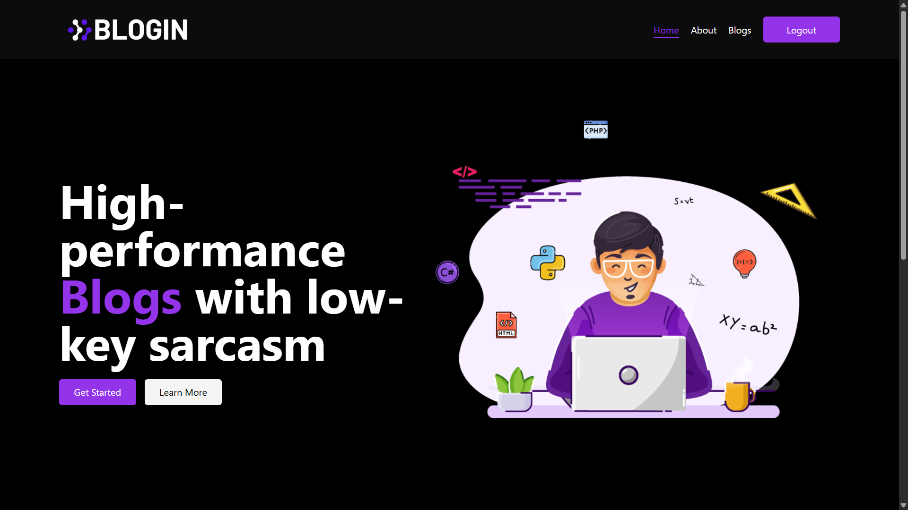
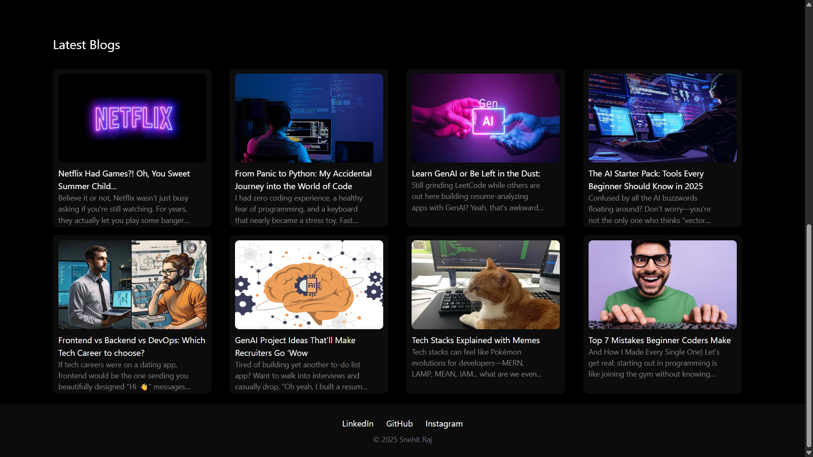
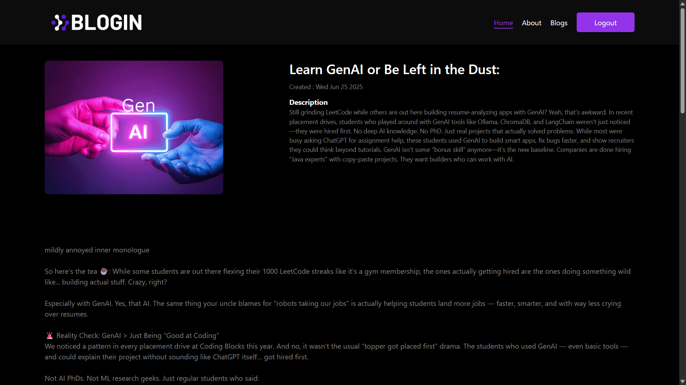
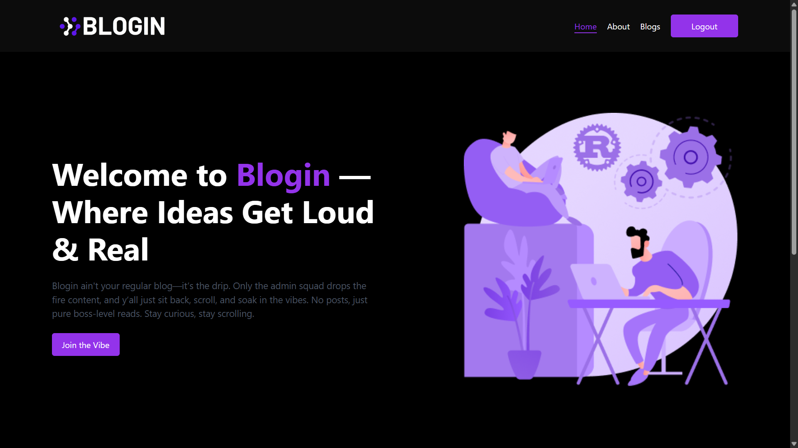
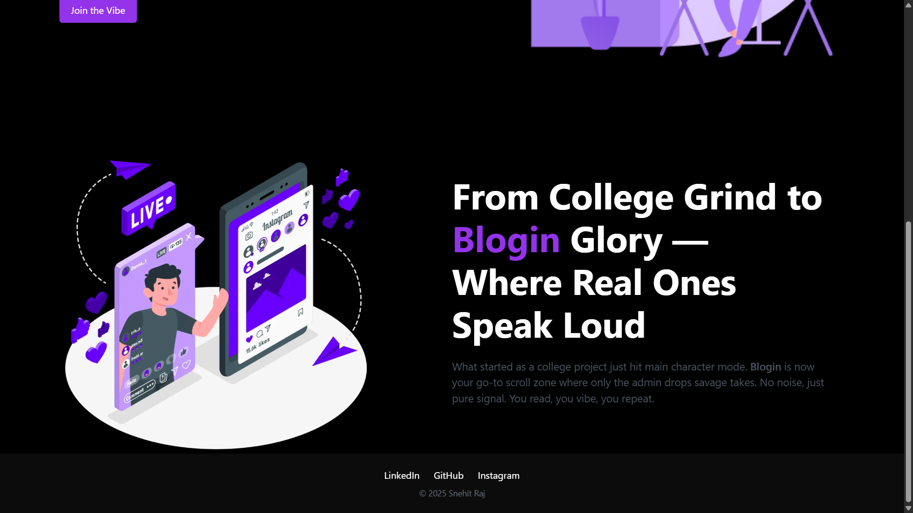
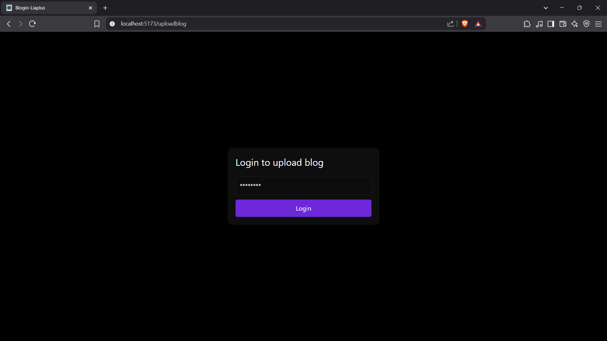
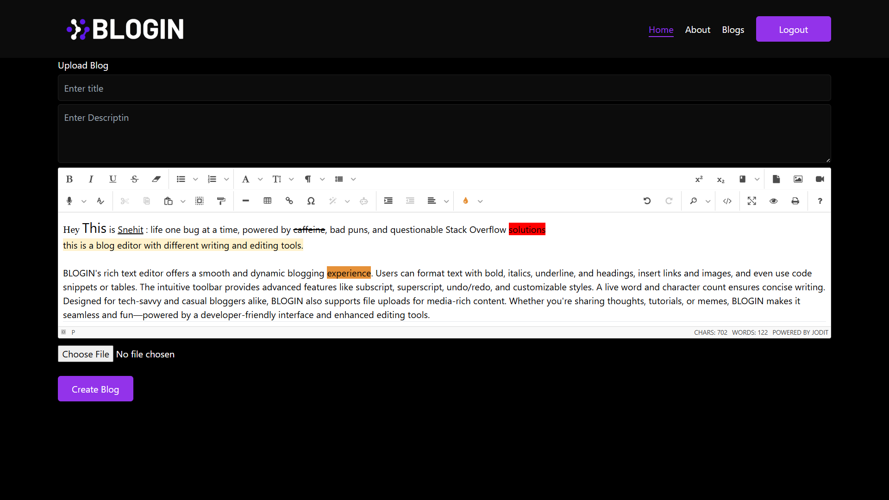

# Blogin — MERN-Powered Blog Platform

A modern, role-based blog platform built with the MERN stack.
Admins post, users scroll — where content meets control, and vibes stay immaculate.

**Frontend:** React (Vite) 
**Backend:** Express + MongoDB + Node.js

---

## ✨ Features

* 🔐 **Role-Based Access Control (RBAC):** Admins manage, users read
* 📝 **Create and Delete Blogs** (Admins only)
* 📖 **Scroll-worthy Reading Experience** for users
* 🌐 **Protected Routes** with JWT Authentication
* 🎨 **Responsive UI** with Tailwind CSS
* 💾 **MongoDB for Blog & User Storage**
* 🧠 **Admin Dashboard** (Coming Soon!)
* 🧁 **Minimalist, Fast, and Clean**

---

## 🖼️ App Screenshots

### 1. Login Page


*Secure login with clean UI.*

### 2. Home Page 


*Welcome to Blogin — scrollable, readable, unforgettable.*


*Explore published blogs from the admin — just click and read.*

### 3. Single Blog Page


*Focused, clean reading experience for every post.*

### 4. About Page (Intro Section)


*Learn what Blogin is all about.*

### 5. About Page (Team/Vibes)


*Blogin’s backstory and the crew behind the chaos.*

### 6. Admin Special Key Page


*Admins enter a secret key to unlock content controls.*

### 7. Admin Upload Blog Page


*Rich-text blog creation for admins — post like a pro.*

---


## 🚀 Getting Started

### 1. Clone the repo

```bash
git clone https://github.com/your-username/blogin.git
```

### 2. Setup Environment Variables

#### Frontend (`frontend/.env`)

```env
VITE_API_URL=https://your-backend-render-url.onrender.com
```

#### Backend (`backend/.env`)

```env
MONGODB_URI=your-mongodb-atlas-uri
JWT_SECRET=your-super-secret
CLIENT_URL=https://your-frontend-vercel-url.vercel.app
PORT=8080
```

### 3. Install Dependencies

#### Frontend

```bash
cd frontend
npm install
```

#### Backend

```bash
cd backend
npm install
```

### 4. Run Locally

**Frontend:**

```bash
npm run dev
```

**Backend:**

```bash
npm start
```

**For admin feautres:**

```bash
/uploadblog
eg- localhost:5173/uploadblog
```

---


## 📈 Future Features

* 🧠 Admin Dashboard
* 🔍 Search & Filters
* 🗂️ Blog Categories/Tags
* ❤️ Likes & Bookmarks
* 🔗 Shareable Links
* 🌐 SEO Optimization
* 🤖 AI Blog Generator (Prompt-based)
* 💬 Reader Comments
* 🤯 AI Replies for Admins
---

**Built with 💻, ☕, and a whole lotta ❤️‍🔥**

---

